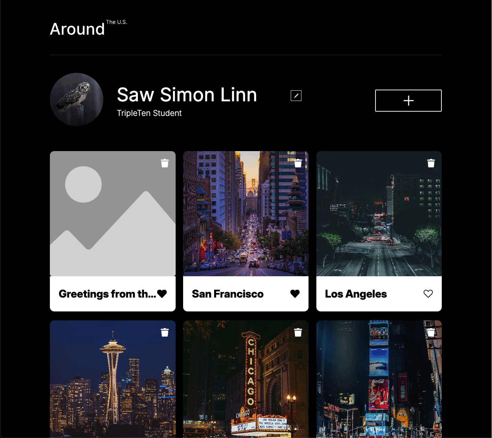

# Around The U.S.

An interactive web application that allows users to explore various locations across the United States, customize their profiles, and manage a personal collection of photos.


## Description

Discover America with "Around the US"! Customize your profile, add stunning photos and titles, then explore six unique layout cards showcasing the nation's beauty. Easily manage your content with delete and like options. Plus, enjoy a seamless experience on any device with our fully responsive website.

## Features

- **Profile Customization:** Update your personal information to personalize your experience.
- **Photo Gallery:** Add, edit, and delete photos with titles to create a unique collection.
- **Responsive Design:** Enjoy a seamless experience across all devices.



## Live Demo

Experience the live version of the project here: [Around The U.S. Live Demo](https://sawsimonlinn.github.io/se_project_aroundtheus/)

## Demo Video

For a comprehensive walkthrough of the application's features, watch the demo video:

[](https://drive.google.com/file/d/1CrEJpvGAuLGDMXcB7MrROz7abOmqNbjR/view?usp=drive_link)

## Deployment and System Requirements

To run this project locally, ensure you have the following:

- **Node.js:** Version 14.x or higher
- **npm:** Version 6.x or higher
- **Webpack:** Version 5.x or higher

**Deployment Instructions:**

1. **Clone the repository:**

   ```bash
   git clone https://github.com/SawSimonLinn/se_project_aroundtheus.git
   ```

   ```bash
   cd se_project_aroundtheus
   ```

2. Install dependencies:

   ```bash
   npm install
   ```

3. Start the development server:

   ```bash
   npm run dev
   ```

4. Build for production:

   ```bash
   npm run build
   ```

5. Deploy the production build:

   The production-ready files will be in the `dist` folder. You can deploy these files to your preferred hosting service.

### Future Improvements

- Enhance User Interactions: Implement animations using CSS and JavaScript to achieve a more dynamic user experience.
- Expand Photo Gallery: Allow users to categorize photos using tags to achieve better organization.
- Improve Accessibility: Conduct an accessibility audit using tools like Lighthouse to achieve a more inclusive design.
